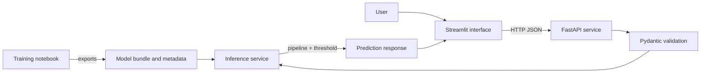

# Loan Approval Predictor


An end-to-end machine-learning project that predicts whether a loan application
resembles historically approved or rejected applications. The repository covers
the complete workflow from exploratory analysis and leakage-safe model training
to a validated inference package, REST API, professional web interface, and
automated tests.

> [!IMPORTANT]
> This project is an educational demonstration. It models historical approval
> decisions—not repayment ability, default risk, or creditworthiness. It must not
> be used to make or support real lending decisions.

## Contents

- [Project overview](#project-overview)
- [Architecture](#architecture)
- [Model development](#model-development)
- [Model performance](#model-performance)
- [Project structure](#project-structure)
- [Getting started](#getting-started)
- [Running the applications](#running-the-applications)
- [Using the API](#using-the-api)
- [Running the tests](#running-the-tests)
- [Experiment tracking](#experiment-tracking)
- [Responsible use and limitations](#responsible-use-and-limitations)

## Project overview

The project treats loan approval as a supervised binary-classification task:

- **Target:** `Loan_Status`
- **Positive class:** `Y` — historically approved
- **Negative class:** `N` — historically rejected
- **Unit of observation:** one loan application
- **Primary model-selection metric:** macro F1

Accuracy is reported, but macro F1 is prioritized because it gives equal
importance to performance on approved and rejected applications. Precision,
recall, balanced accuracy, ROC-AUC, Brier score, and log loss are also tracked.

### Key capabilities

- Data validation, missing-value analysis, categorical EDA, and outlier review
- Stratified train/holdout separation before preprocessing decisions
- Leakage-safe numerical and categorical preprocessing
- Cross-validated baseline and candidate-model comparison
- Optuna hyperparameter optimization
- Out-of-fold decision-threshold selection
- Permutation importance and demographic fairness diagnostics
- MLflow experiment tracking with a SQLite backend
- Versioned model bundle with schema, labels, threshold, and checksum metadata
- Reusable, validated Python inference service
- FastAPI endpoints with Pydantic request and response schemas
- Streamlit interface with guided inputs and responsible-use explanations
- Automated inference, API, API-client, and Streamlit tests

## Architecture



The Streamlit application never loads the model directly. It sends validated
application data to FastAPI, which delegates prediction to the reusable
`LoanApprovalService`. This separation keeps presentation, transport,
validation, and inference responsibilities independent.

## Model development

The complete research workflow is recorded in [`main.ipynb`](main.ipynb).

### Data

The dataset is stored at [`data/raw/Finance.csv`](data/raw/Finance.csv) and
contains 614 applications with 11 predictive features, an identifier column,
and the target.

The features include:

- Demographic and household attributes
- Education and self-employment status
- Applicant and co-applicant income
- Requested loan amount and term
- Recorded credit-history status
- Property-area category

Before publishing or redistributing the dataset, confirm that its original
license permits redistribution. If redistribution is not permitted, remove the
CSV from the public repository and provide data-download instructions instead.

### Training workflow

1. Validate schema, duplicates, missing values, categories, and target balance.
2. Reserve a stratified holdout set before preprocessing or model selection.
3. Fit imputation, transformation, scaling, and one-hot encoding only inside
   Scikit-learn pipelines.
4. Establish a majority-class baseline.
5. Compare linear, tree, ensemble, histogram-boosting, LightGBM, and XGBoost
   classifiers with identical stratified cross-validation folds.
6. Tune the leading histogram-gradient-boosting model with Optuna.
7. Select the model configuration using cross-validated macro F1.
8. Select the classification threshold from out-of-fold training predictions.
9. Run feature-importance and group-level fairness diagnostics.
10. Evaluate once on the untouched holdout set.
11. Export the fitted pipeline, threshold, schema, labels, metadata, and hash.

### Selected model

| Property | Value |
|---|---:|
| Classifier | `HistGradientBoostingClassifier` |
| Selected configuration | Untuned HGB |
| Classification threshold | `0.34` |
| Training rows | 491 |
| Holdout rows | 123 |
| Model version | `1.0.0` |

The untuned configuration was retained because tuning did not provide a reliable
improvement under the project’s cross-validation objective. Keeping the simpler
configuration avoids unnecessary complexity.

## Model performance

Performance on the untouched final holdout set:

| Metric | Score |
|---|---:|
| Accuracy | 0.821 |
| Balanced accuracy | 0.769 |
| Macro F1 | 0.780 |
| ROC-AUC | 0.790 |
| Approval precision | 0.846 |
| Approval recall | 0.906 |
| Rejection precision | 0.750 |
| Rejection recall | 0.632 |
| Brier score | 0.165 |
| Log loss | 0.665 |

The model detects historically approved applications more reliably than
historically rejected applications. The lower rejection recall is important and
must not be hidden behind the overall accuracy score.

Full metadata is available in
[`artifacts/loan_approval_model_metadata.json`](artifacts/loan_approval_model_metadata.json).

## Project structure

```text
loan_approval_predictor/
├── api/
│   └── main.py                       # FastAPI application and routes
├── artifacts/
│   ├── loan_approval_model.joblib    # Fitted pipeline and model bundle
│   └── loan_approval_model_metadata.json
├── data/
│   └── raw/
│       └── Finance.csv
├── loan_approval/
│   ├── __init__.py
│   ├── api_client.py                 # HTTP client used by Streamlit
│   ├── inference.py                  # Validated inference service
│   └── schemas.py                    # Pydantic API schemas
├── tests/
│   ├── test_api.py
│   ├── test_api_client.py
│   ├── test_inference.py
│   └── test_streamlit_app.py
├── .streamlit/
│   └── config.toml                   # Professional application theme
├── main.ipynb                        # End-to-end ML research workflow
├── streamlit_app.py                  # Interactive web interface
├── pyproject.toml                    # Dependencies and project metadata
└── uv.lock                           # Reproducible dependency lockfile
```

## Getting started

### Prerequisites

- Python 3.11 or newer
- [uv](https://docs.astral.sh/uv/) for environment and dependency management

### Installation

Clone the repository and enter the project directory:

```bash
git clone <your-repository-url>
cd loan_approval_predictor
```

Create the virtual environment and install locked application and development
dependencies:

```bash
uv sync --dev
```

### Optional Jupyter kernel

To work in the training notebook with the project environment:

```bash
uv run python -m ipykernel install --user \
  --name loan-approval-predictor \
  --display-name "Python (Loan Approval Predictor)"
```

Then open [`main.ipynb`](main.ipynb) and select
**Python (Loan Approval Predictor)** as the kernel.

## Running the applications

FastAPI and Streamlit are separate processes. Run them in two terminals from the
project root.

### Terminal 1 — FastAPI

```bash
uv run uvicorn api.main:app --reload --host 127.0.0.1 --port 8000
```

Available URLs:

- Health check: <http://127.0.0.1:8000/health>
- Interactive API documentation: <http://127.0.0.1:8000/docs>
- OpenAPI schema: <http://127.0.0.1:8000/openapi.json>

### Terminal 2 — Streamlit

```bash
uv run streamlit run streamlit_app.py
```

Open <http://localhost:8501>.

The Streamlit client uses `http://127.0.0.1:8000` by default. Override the API
address with `LOAN_API_URL` when needed:

```bash
# macOS or Linux
export LOAN_API_URL="http://127.0.0.1:8000"
```

```powershell
# Windows PowerShell
$env:LOAN_API_URL = "http://127.0.0.1:8000"
```

### Direct virtual-environment commands on Windows

If the local `uv` cache is unavailable because of Windows permissions, use the
existing virtual environment directly:

```powershell
.\.venv\Scripts\python.exe -m uvicorn api.main:app --reload
.\.venv\Scripts\python.exe -m streamlit run streamlit_app.py
```

## Using the API

### Endpoints

| Method | Endpoint | Purpose |
|---|---|---|
| `GET` | `/health` | Check API and model availability |
| `GET` | `/model-info` | Retrieve model version, threshold, and input schema |
| `POST` | `/predict` | Validate an application and return a prediction |

### Example prediction request

```bash
curl -X POST "http://127.0.0.1:8000/predict" \
  -H "Content-Type: application/json" \
  -d '{
    "gender": "Male",
    "married": "Yes",
    "dependents": "0",
    "education": "Graduate",
    "self_employed": "No",
    "applicant_income": 5500,
    "coapplicant_income": 2000,
    "loan_amount": 120,
    "loan_amount_term": 360,
    "credit_history": 1,
    "property_area": "Semiurban"
  }'
```

Example response:

```json
{
  "prediction": "Approved",
  "predicted_label": "Y",
  "encoded_prediction": 1,
  "approval_score": 0.9984,
  "classification_threshold": 0.34,
  "model_version": "1.0.0",
  "disclaimer": "This prediction reflects patterns in historical approval decisions. It does not measure repayment ability and must not be used as an autonomous lending decision."
}
```

The precise score depends on the submitted values and exported model artifact.
The approval score is a model score, not a guaranteed probability.

## Running the tests

Run the complete test suite:

```bash
uv run pytest -v -p no:cacheprovider
```

Windows virtual-environment alternative:

```powershell
.\.venv\Scripts\python.exe -m pytest -v -p no:cacheprovider
```

The suite currently contains 23 tests covering:

- Model loading, metadata, validation, and deterministic inference
- Valid and invalid FastAPI requests
- HTTP-client success and failure handling
- Streamlit rendering and prediction-form submission

The Streamlit tests use mocked API responses, so the API and web servers do not
need to be running during testing.

## Experiment tracking

The notebook logs experiments to an MLflow SQLite backend. After running the
training workflow, launch the local MLflow interface with:

```bash
uv run mlflow ui --backend-store-uri sqlite:///mlflow.db
```

Then open <http://127.0.0.1:5000>.

Local MLflow runs and the SQLite database are intentionally excluded from Git.
The exported model metadata remains versioned in `artifacts/`.

## Responsible use and limitations

This project has several material limitations:

- The target represents historical approval decisions, not repayment or default.
- The dataset contains only 614 applications.
- Historical outcomes may encode institutional or demographic bias.
- Group-level fairness estimates are uncertain for small groups.
- Sensitive demographic variables are present in the original feature set.
- Model scores are not guaranteed to be calibrated probabilities.
- Performance may degrade when future data differs from the training data.
- The system has no authentication, authorization, audit logging, or production
  monitoring.

For any real financial application, additional legal review, data-governance
controls, fairness assessment, security, monitoring, human oversight, and model
risk management would be required.

## Future improvements

- Add continuous integration for automated tests
- Add drift and data-quality monitoring
- Add authentication and structured audit logging
- Expand fairness evaluation with larger representative datasets
- Add model-calibration analysis
- Publish a hosted demonstration after completing a security review

## License

No open-source license has been selected yet. Add a `LICENSE` file before
granting permission for others to copy, modify, or redistribute the project.
